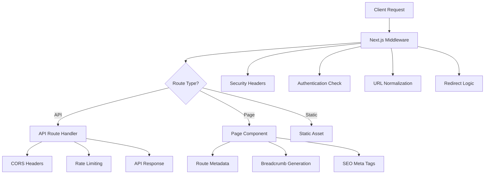
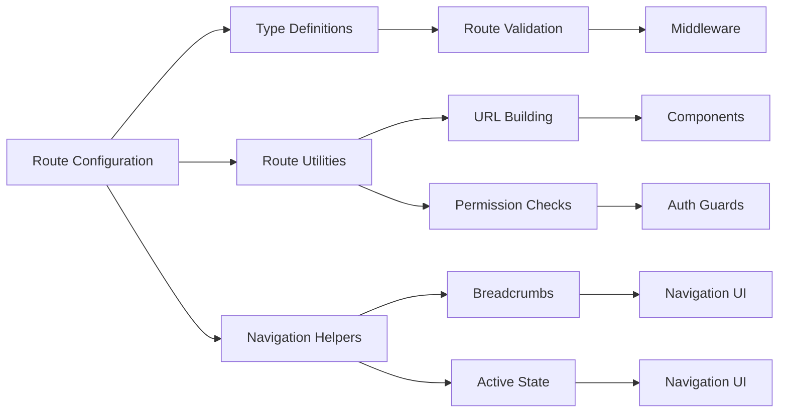

# Professional URL Routing System Design

## Overview

This design implements a comprehensive, enterprise-grade URL routing system for the AutoDoc AI application. The system provides clean URLs, robust navigation, security middleware, SEO optimization, and internationalization support while maintaining high performance and developer experience.

The design leverages Next.js 14's App Router with enhanced middleware, centralized route management, and professional navigation patterns used by modern web applications.

## Architecture

### High-Level Architecture



### Route Management Architecture



## Components and Interfaces

### 1. Enhanced Route Configuration

**File: `src/lib/routes/config.ts`**
- Centralized route definitions with TypeScript types
- Route metadata including SEO information
- Permission and authentication requirements
- Internationalization support

**File: `src/lib/routes/types.ts`**
- TypeScript interfaces for route objects
- Route metadata types
- Navigation item types
- Breadcrumb types

### 2. Advanced Middleware System

**File: `src/middleware.ts`** (Enhanced)
- URL normalization (lowercase, trailing slashes)
- Authentication and authorization checks
- Security headers injection
- CORS handling for API routes
- Rate limiting implementation
- Redirect logic for SEO

### 3. Navigation Management

**File: `src/lib/navigation/index.ts`**
- Navigation tree generation
- Active route detection
- Breadcrumb generation
- Route permission checking

**File: `src/lib/navigation/breadcrumbs.ts`**
- Automatic breadcrumb generation from URL structure
- Custom breadcrumb overrides
- Accessibility-compliant markup

### 4. SEO and Metadata System

**File: `src/lib/seo/metadata.ts`**
- Dynamic meta tag generation
- Open Graph and Twitter Card support
- Canonical URL management
- Structured data generation

**File: `src/lib/seo/sitemap.ts`**
- Dynamic sitemap generation
- Route priority and change frequency
- Multi-language sitemap support

### 5. Route Protection and Guards

**File: `src/components/routing/RouteGuard.tsx`**
- Client-side route protection
- Loading states during authentication checks
- Redirect handling with return URLs

**File: `src/components/routing/ProtectedRoute.tsx`**
- Higher-order component for route protection
- Permission-based access control
- Fallback UI for unauthorized access

### 6. Internationalization Support

**File: `src/lib/i18n/routing.ts`**
- Locale-aware URL generation
- Language detection and redirection
- Alternate language link generation

## Data Models

### Route Configuration Model

```typescript
interface RouteConfig {
  path: string
  name: string
  component?: string
  metadata: RouteMetadata
  permissions?: RoutePermissions
  children?: RouteConfig[]
  redirects?: RouteRedirect[]
  i18n?: I18nConfig
}

interface RouteMetadata {
  title: string
  description: string
  keywords?: string[]
  ogImage?: string
  canonical?: string
  noIndex?: boolean
  priority?: number
  changeFreq?: 'always' | 'hourly' | 'daily' | 'weekly' | 'monthly' | 'yearly' | 'never'
}

interface RoutePermissions {
  requiresAuth: boolean
  roles?: string[]
  permissions?: string[]
  redirectTo?: string
}
```

### Navigation Model

```typescript
interface NavigationItem {
  id: string
  name: string
  href: string
  icon?: string
  description?: string
  isExternal?: boolean
  children?: NavigationItem[]
  permissions?: RoutePermissions
  metadata?: {
    badge?: string
    isNew?: boolean
    isPopular?: boolean
  }
}

interface BreadcrumbItem {
  name: string
  href?: string
  current: boolean
  icon?: string
}
```

### SEO Model

```typescript
interface SEOData {
  title: string
  description: string
  keywords?: string[]
  canonical?: string
  ogTitle?: string
  ogDescription?: string
  ogImage?: string
  ogType?: string
  twitterCard?: 'summary' | 'summary_large_image'
  twitterTitle?: string
  twitterDescription?: string
  twitterImage?: string
  structuredData?: object
  alternateLanguages?: AlternateLanguage[]
}

interface AlternateLanguage {
  lang: string
  href: string
}
```

## Error Handling

### 1. Custom Error Pages

**404 Not Found Page**
- Custom design matching application theme
- Helpful navigation suggestions
- Search functionality
- Popular pages links

**500 Server Error Page**
- Error reporting functionality
- Recovery suggestions
- Contact information
- Fallback navigation

### 2. Route Validation

**Client-Side Validation**
- Real-time route validation
- Invalid route detection
- Graceful fallbacks

**Server-Side Validation**
- Middleware-level route checking
- Proper HTTP status codes
- Security validation

### 3. Error Boundaries

**Route-Level Error Boundaries**
- Catch and handle routing errors
- Fallback UI components
- Error reporting integration

## Testing Strategy

### 1. Unit Tests

**Route Configuration Tests**
```typescript
// Test route validation
describe('Route Configuration', () => {
  test('should validate route paths', () => {
    expect(isValidRoute('/docs/api')).toBe(true)
    expect(isValidRoute('/invalid-route')).toBe(false)
  })
  
  test('should generate correct breadcrumbs', () => {
    const breadcrumbs = generateBreadcrumbs('/docs/api/authentication')
    expect(breadcrumbs).toHaveLength(4)
    expect(breadcrumbs[3].current).toBe(true)
  })
})
```

**Navigation Tests**
```typescript
// Test navigation utilities
describe('Navigation Utilities', () => {
  test('should detect active routes correctly', () => {
    expect(isActivePath('/docs/api', '/docs/api/auth')).toBe(true)
    expect(isActivePath('/docs', '/features')).toBe(false)
  })
})
```

### 2. Integration Tests

**Middleware Tests**
```typescript
// Test middleware functionality
describe('Routing Middleware', () => {
  test('should redirect trailing slashes', async () => {
    const response = await middleware(createMockRequest('/docs/'))
    expect(response.status).toBe(301)
    expect(response.headers.get('location')).toBe('/docs')
  })
  
  test('should protect authenticated routes', async () => {
    const response = await middleware(createMockRequest('/settings'))
    expect(response.status).toBe(302)
    expect(response.headers.get('location')).toContain('/login')
  })
})
```

### 3. End-to-End Tests

**Navigation Flow Tests**
```typescript
// Test complete navigation flows
describe('Navigation Flows', () => {
  test('should navigate through documentation sections', async () => {
    await page.goto('/docs')
    await page.click('[data-testid="api-docs-link"]')
    expect(page.url()).toContain('/docs/api')
    
    const breadcrumbs = await page.$$('[data-testid="breadcrumb-item"]')
    expect(breadcrumbs).toHaveLength(3)
  })
})
```

### 4. Performance Tests

**Route Performance Tests**
```typescript
// Test routing performance
describe('Route Performance', () => {
  test('should load routes within performance budget', async () => {
    const startTime = performance.now()
    await page.goto('/docs/api')
    const loadTime = performance.now() - startTime
    expect(loadTime).toBeLessThan(1000) // 1 second budget
  })
})
```

## Security Considerations

### 1. Route Protection
- Authentication middleware for protected routes
- Role-based access control
- CSRF protection for state-changing operations

### 2. Input Validation
- URL parameter sanitization
- Query parameter validation
- Path traversal prevention

### 3. Security Headers
- Content Security Policy (CSP)
- X-Frame-Options
- X-Content-Type-Options
- Referrer-Policy

### 4. Rate Limiting
- API route rate limiting
- Per-user request limits
- DDoS protection

## Performance Optimizations

### 1. Route Prefetching
- Intelligent link prefetching
- Critical route preloading
- Lazy loading for non-critical routes

### 2. Caching Strategy
- Route metadata caching
- Navigation data caching
- CDN integration for static routes

### 3. Bundle Optimization
- Route-based code splitting
- Dynamic imports for large components
- Tree shaking for unused routes

## Implementation Phases

### Phase 1: Core Infrastructure
1. Enhanced route configuration system
2. Advanced middleware implementation
3. Basic navigation utilities

### Phase 2: Navigation and SEO
1. Breadcrumb system
2. SEO metadata management
3. Sitemap generation

### Phase 3: Advanced Features
1. Internationalization support
2. Route protection and guards
3. Performance optimizations

### Phase 4: Testing and Polish
1. Comprehensive test suite
2. Error handling improvements
3. Documentation and examples